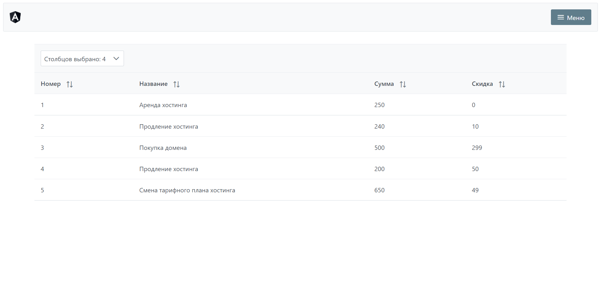

# PaymentApp

Мини-проект написанный на Angular 12 и PrimeNG.

В проекте есть 4 компонента: app, header, menu, table и модель Payment.
Шапка приложения представляет из себя логотип и компонент menu.
Таблицу возможно сортировать по конкретному столбцу или задать видимость столбца.

--------------------------

# Запуск приложения
1. npm install
2. ng serve
